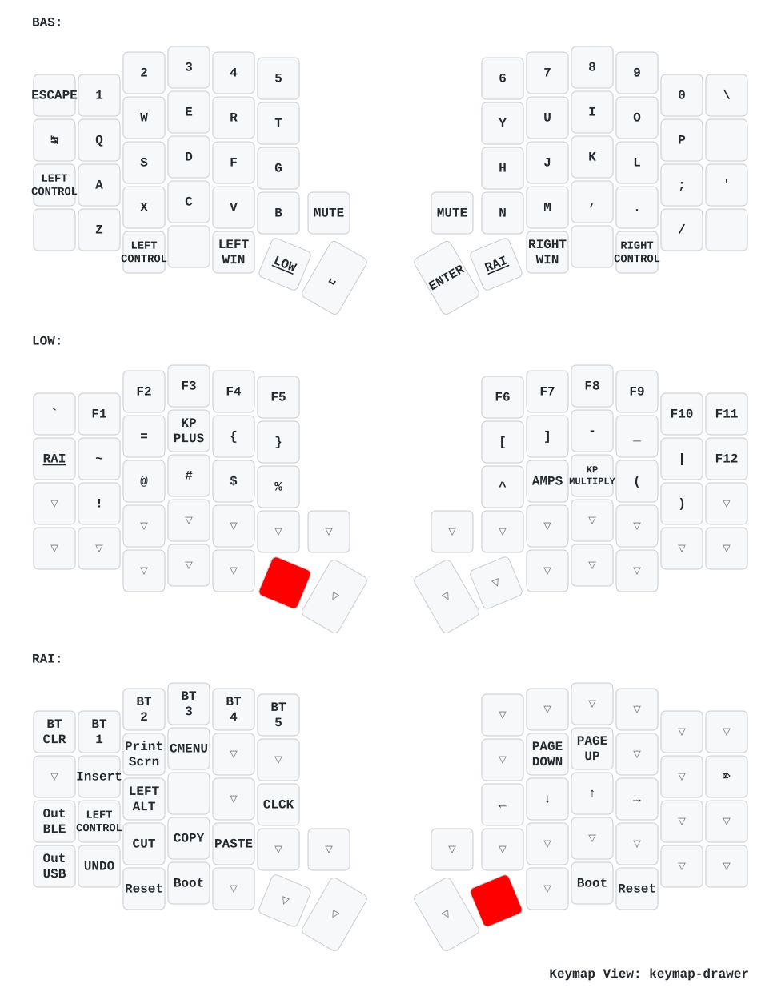

# Sofle v1 ZMK configs

 

# INTRO

The objective of this repository is to serve as a base for configuring your
corne - sofle - lily58 keyboard with the firmware [ZMK firmware] in a simple and fast way.
without having to configure everything from scratch. Many of us are fascinated
by customizing our keyboards, but sometimes we don't have the time or
experience to do it. That is why I have decided to create this repository so
that you can have a base configuration and you can modify it to your liking.

This base includes the most recent corne - sofle - lily58 configurations, featuring a setup for
the corne - sofle - lily58 dongle with/without an OLED screen.
You can also use your keyboard WITH / WITHOUT a dongle of course. with any of the
plates or screens you have.

Tested with **[puchi_ble_v1]** (used as a dongle and as
peripherals), **[nice_nano_v2]** (used as a dongle and as peripherals),
**clones of nice_nano_v2** (used as a dongle and as peripherals), and the
**[seeeduino_xiao_ble]** (used only as a dongle).

| Main Pros                                                                                       |
| ----------------------------------------------------------------------------------------------- |
| mobility and flexibility                                                                        |
| reduction of tension and fatigue (ergonomic and ortholinear)                                    |
| improved productivity                                                                           |
| bluetooth and usb-c connection                                                                  |
| Highly customizable programmable with [ZMK firmware].                                           |
| compatibility with linux, windows, macos, android, ios and more                                 |
| completely wireless between the two halves and with the PC                                      |
| ultra-low consumption. extends battery life to the limit                                        |
| drag and drop thanks to the included uf2 bootloader                                             |
| no additional software required for flashing                                                    |
| support for multiple devices (up to 5)                                                          |
| mouse keys                                                                                      |
| rgb                                                                                             |
| macros                                                                                          |
| tap dance                                                                                       |
| combos                                                                                          |
| up to 1 week of use without charger (with 100mah)                                               |
| support [nice-view] screen and oled screen                                                      |
| online editor for keymap. see [keymap-editor]                                                   |
| 100% open source                                                                                |
| support for puchi-ble dongle, nice!nano v2, nice!nano v2 clones, seeeduino xiao ble and more... |
| support with dongle with display 128x32, 128x64 and 128x128                                     |
| and more...                                                                                     |

# QUICK START

> [!NOTE]
>
> 1. With this configuration you can use the corne - sofle - lily58 keyboard practically
>    immediately, you just have to follow the following steps and that's it.
>
> 2. If you need precompiled files you can download them from the [firmware
>    folder](./firmware)
>
> 3. If you have any problems, you just have to flash the reset firmwares that
>    are in the [firmware](./firmware) folder and that's it.
>
> 4. Disable the builds you don't need in the file [build.yaml](./build.yaml),
>    by default they are all activated.

### zmk-studio (quick start)

This repository includes the necessary configuration to use zmk-studio without
the need to configure anything else. You just have to follow the steps below:

-   fork this repository y flash the firmware to the keyboard with the uf2 files (see as below en normal procedure)
-   connect the master (dongle or central) to the PC
-   Modify the keyboard mapping on the go with [ZMK Studio
    Web](https://zmk.studio/) and enjoy the changes!

### normal procedure

1. Fork this repository (I appreciate if you follow me on [github] and [youtube])
2. Modify the keyboard mapping with [keymap-editor]. If you want to read about
   the features of this editor you can do so here: [ZMK Studio Web](https://zmk.studio/) or [keymap-editor](https://github.com/nickcoutsos/keymap-editor).
3. Save changes and commit (optional)
4. Go to actions on github and download the artifacts
    - Actions(click) -> All Workflows (click)-> Initial User Config. (here you
      scroll to the bottom and click)
    - Here is something called artifacts, click to download the file, it is a .zip
    - now go to download on your computer (or wherever you have downloads by default):
    - unzip the .zip file
    - Connect the nice!nano v2 microcontroller to the USB-C port of your computer
    - the microcontroller is recognized as a storage device
5. Flash the firmware to the keyboard with the uf2 files (drag and drop and WITH dongle)
    - xiao_corne_dongle_xiao_dongle_display.uf2 for [seeeduino_xiao_ble] as a dongle
    - nice_corne_left_peripheral.uf2 for [nice_nano_v2] as a peripheral
    - nice_corne_right.uf2 for [nice_nano_v2] as a peripheral
6. Flash the firmware to the keyboard with the uf2 files (drag and drop and WITHOUT dongle)
    - nice_corne_left.uf2 for [nice_nano_v2] as a master side
    - nice_corne_right.uf2 for [nice_nano_v2] as a peripheral
7. If you need help, you can ask in the [ZMK Discord]
8. Enjoy your new keyboard

Here you can see the visual changes to the configuration:

## keymap sofle

